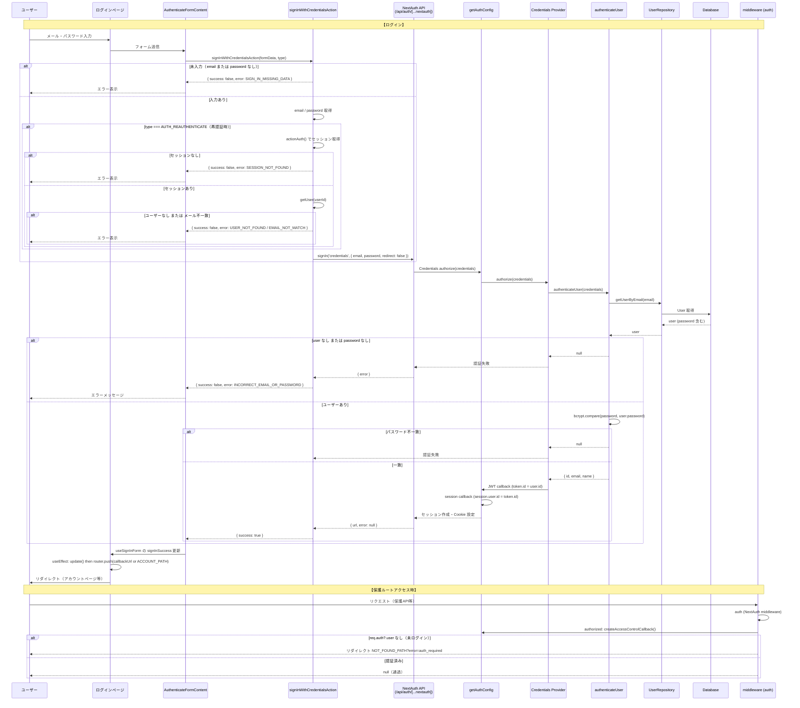

```mermaid
sequenceDiagram
    participant User as ユーザー
    participant LoginPage as ログインページ
    participant Form as AuthenticateFormContent
    participant FormAction as signInWithCredentialsAction
    participant NextAuthAPI as NextAuth API<br/>(/api/auth/[...nextauth])
    participant AuthConfig as getAuthConfig
    participant CredentialsProvider as Credentials Provider
    participant AuthService as authenticateUser
    participant Repository as UserRepository
    participant DB as Database
    participant Middleware as middleware (auth)

    Note over User,Middleware: 【ログイン】

    User->>LoginPage: メール・パスワード入力
    LoginPage->>Form: フォーム送信
    Form->>FormAction: signInWithCredentialsAction(formData, type)

    alt 未入力（email または password なし）
        FormAction-->>Form: { success: false, error: SIGN_IN_MISSING_DATA }
        Form-->>User: エラー表示
    else 入力あり
        FormAction->>FormAction: email / password 取得
        alt type === AUTH_REAUTHENTICATE（再認証時）
            FormAction->>FormAction: actionAuth() でセッション取得
            alt セッションなし
                FormAction-->>Form: { success: false, error: SESSION_NOT_FOUND }
                Form-->>User: エラー表示
            else セッションあり
                FormAction->>FormAction: getUser(userId)
                alt ユーザーなし または メール不一致
                    FormAction-->>Form: { success: false, error: USER_NOT_FOUND / EMAIL_NOT_MATCH }
                    Form-->>User: エラー表示
                end
            end
        end
        FormAction->>NextAuthAPI: signIn('credentials', { email, password, redirect: false })
    end

    NextAuthAPI->>AuthConfig: Credentials authorize(credentials)
    AuthConfig->>CredentialsProvider: authorize(credentials)
    CredentialsProvider->>AuthService: authenticateUser(credentials)

    AuthService->>Repository: getUserByEmail(email)
    Repository->>DB: User 取得
    DB-->>Repository: user (password 含む)
    Repository-->>AuthService: user

    alt user なし または password なし
        AuthService-->>CredentialsProvider: null
        CredentialsProvider-->>NextAuthAPI: 認証失敗
        NextAuthAPI-->>FormAction: { error }
        FormAction-->>Form: { success: false, error: INCORRECT_EMAIL_OR_PASSWORD }
        Form-->>User: エラーメッセージ
    else ユーザーあり
        AuthService->>AuthService: bcrypt.compare(password, user.password)
        alt パスワード不一致
            AuthService-->>CredentialsProvider: null
            CredentialsProvider-->>FormAction: 認証失敗
        else 一致
            AuthService-->>CredentialsProvider: { id, email, name }
            CredentialsProvider->>AuthConfig: JWT callback (token.id = user.id)
            AuthConfig->>AuthConfig: session callback (session.user.id = token.id)
            AuthConfig-->>NextAuthAPI: セッション作成・Cookie 設定
            NextAuthAPI-->>FormAction: { url, error: null }
            FormAction-->>Form: { success: true }
        end
    end

    Form->>LoginPage: useSignInForm の signInSuccess 更新
    LoginPage->>LoginPage: useEffect: update() then router.push(callbackUrl or ACCOUNT_PATH)
    LoginPage->>User: リダイレクト（アカウントページ等）

    Note over User,Middleware: 【保護ルートアクセス時】

    User->>Middleware: リクエスト（保護API等）
    Middleware->>Middleware: auth (NextAuth middleware)
    Middleware->>AuthConfig: authorized: createAccessControlCallback()
    alt req.auth?.user なし（未ログイン）
        Middleware-->>User: リダイレクト NOT_FOUND_PATH?error=auth_required
    else 認証済み
        Middleware-->>User: null（通過）
    end
```