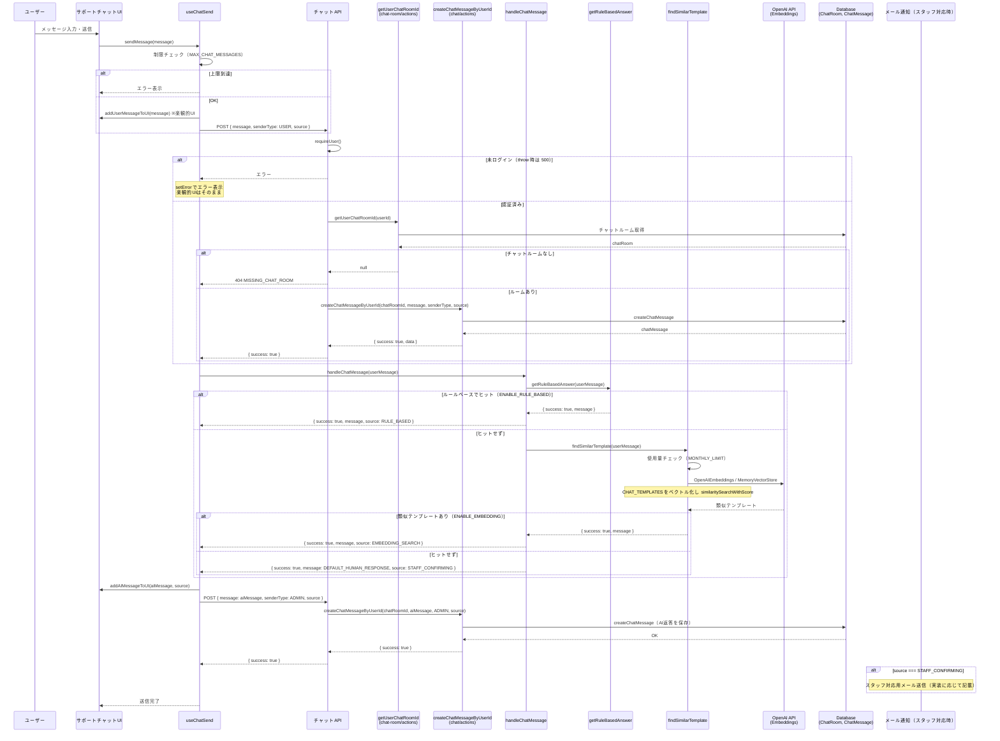

```mermaid
sequenceDiagram
    participant User as ユーザー
    participant ChatUI as サポートチャットUI
    participant Hook as useChatSend
    participant ChatAPI as チャットAPI
    participant ChatRoomService as getUserChatRoomId<br/>(chat-room/actions)
    participant ChatService as createChatMessageByUserId<br/>(chat/actions)
    participant HybridService as handleChatMessage
    participant RuleBased as getRuleBasedAnswer
    participant EmbeddingService as findSimilarTemplate
    participant OpenAI as OpenAI API<br/>(Embeddings)
    participant DB as Database<br/>(ChatRoom, ChatMessage)
    participant EmailService as メール通知（スタッフ対応時）

    User->>ChatUI: メッセージ入力・送信
    ChatUI->>Hook: sendMessage(message)

    Hook->>Hook: 制限チェック（MAX_CHAT_MESSAGES）
    alt 上限到達
        Hook-->>ChatUI: エラー表示
    else OK
        Hook->>ChatUI: addUserMessageToUI(message) ※楽観的UI
        Hook->>ChatAPI: POST { message, senderType: USER, source }
    end

    ChatAPI->>ChatAPI: requireUser()
    alt 未ログイン（throw 時は 500）
        ChatAPI-->>Hook: エラー
        Note over Hook: setError でエラー表示<br/>楽観的UIはそのまま
    else 認証済み
        ChatAPI->>ChatRoomService: getUserChatRoomId(userId)
        ChatRoomService->>DB: チャットルーム取得
        DB-->>ChatRoomService: chatRoom
        alt チャットルームなし
            ChatRoomService-->>ChatAPI: null
            ChatAPI-->>Hook: 404 MISSING_CHAT_ROOM
        else ルームあり
            ChatAPI->>ChatService: createChatMessageByUserId(chatRoomId, message, senderType, source)
            ChatService->>DB: createChatMessage
            DB-->>ChatService: chatMessage
            ChatService-->>ChatAPI: { success: true, data }
            ChatAPI-->>Hook: { success: true }
        end
    end

    Hook->>HybridService: handleChatMessage(userMessage)

    HybridService->>RuleBased: getRuleBasedAnswer(userMessage)
    alt ルールベースでヒット（ENABLE_RULE_BASED）
        RuleBased-->>HybridService: { success: true, message }
        HybridService-->>Hook: { success: true, message, source: RULE_BASED }
    else ヒットせず
        HybridService->>EmbeddingService: findSimilarTemplate(userMessage)
        EmbeddingService->>EmbeddingService: 使用量チェック（MONTHLY_LIMIT）
        EmbeddingService->>OpenAI: OpenAIEmbeddings / MemoryVectorStore
        Note over EmbeddingService: CHAT_TEMPLATES をベクトル化し similaritySearchWithScore
        OpenAI-->>EmbeddingService: 類似テンプレート
        alt 類似テンプレートあり（ENABLE_EMBEDDING）
            EmbeddingService-->>HybridService: { success: true, message }
            HybridService-->>Hook: { success: true, message, source: EMBEDDING_SEARCH }
        else ヒットせず
            HybridService-->>Hook: { success: true, message: DEFAULT_HUMAN_RESPONSE, source: STAFF_CONFIRMING }
        end
    end

    Hook->>ChatUI: addAIMessageToUI(aiMessage, source)
    Hook->>ChatAPI: POST { message: aiMessage, senderType: ADMIN, source }
    ChatAPI->>ChatService: createChatMessageByUserId(chatRoomId, aiMessage, ADMIN, source)
    ChatService->>DB: createChatMessage（AI返答を保存）
    DB-->>ChatService: OK
    ChatService-->>ChatAPI: { success: true }
    ChatAPI-->>Hook: { success: true }

    alt source === STAFF_CONFIRMING
        Note over EmailService: スタッフ対応用メール送信（実装に応じて記載）
    end

    Hook-->>ChatUI: 送信完了
```