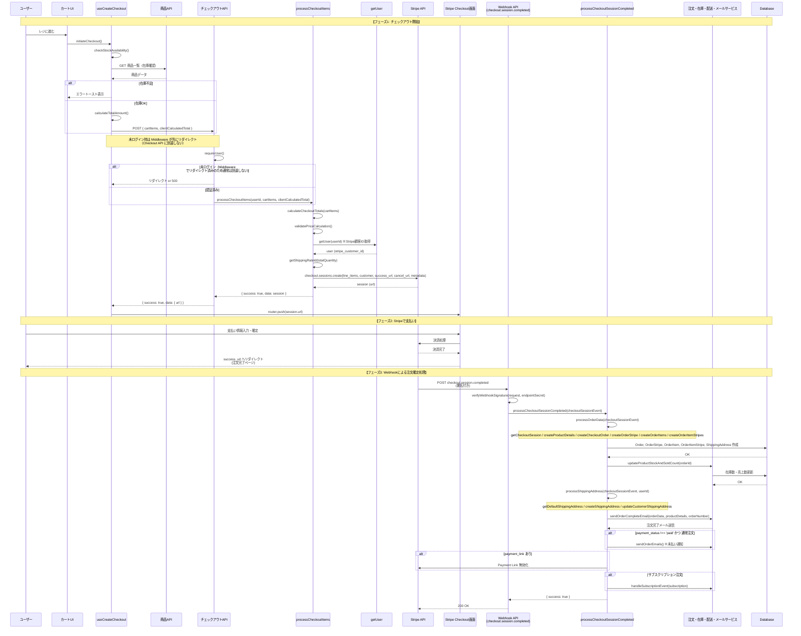

```mermaid
sequenceDiagram
    participant User as ユーザー
    participant CartUI as カートUI
    participant Hook as useCreateCheckout
    participant ProductsAPI as 商品API
    participant CheckoutAPI as チェックアウトAPI
    participant CheckoutService as processCheckoutItems
    participant UserService as getUser
    participant StripeAPI as Stripe API
    participant StripeCheckout as Stripe Checkout画面
    participant WebhookAPI as Webhook API<br/>(checkout.session.completed)
    participant WebhookService as processCheckoutSessionCompleted
    participant OrderService as 注文・在庫・配送・メールサービス
    participant DB as Database

    Note over User,DB: 【フェーズ1: チェックアウト開始】

    User->>CartUI: レジに進む
    CartUI->>Hook: initiateCheckout()

    Hook->>Hook: checkStockAvailability()
    Hook->>ProductsAPI: GET 商品一覧（在庫確認）
    ProductsAPI-->>Hook: 商品データ

    alt 在庫不足
        Hook-->>CartUI: エラートースト表示
    else 在庫OK
        Hook->>Hook: calculateTotalAmount()
        Hook->>CheckoutAPI: POST { cartItems, clientCalculatedTotal }
    end

    Note over Hook,CheckoutAPI: 未ログイン時は Middleware が先にリダイレクト<br/>（Checkout API に到達しない）

    CheckoutAPI->>CheckoutAPI: requireUser()
    alt 未ログイン（Middleware でリダイレクト済みのため通常は到達しない）
        CheckoutAPI-->>Hook: リダイレクト or 500
    else 認証済み
        CheckoutAPI->>CheckoutService: processCheckoutItems(userId, cartItems, clientCalculatedTotal)
    end

    CheckoutService->>CheckoutService: calculateCheckoutTotals(cartItems)
    CheckoutService->>CheckoutService: validatePriceCalculation()
    CheckoutService->>UserService: getUser(userId) ※Stripe顧客ID取得
    UserService-->>CheckoutService: user (stripe_customer_id)
    CheckoutService->>CheckoutService: getShippingRateId(totalQuantity)
    CheckoutService->>StripeAPI: checkout.sessions.create(line_items, customer, success_url, cancel_url, metadata)
    StripeAPI-->>CheckoutService: session (url)
    CheckoutService-->>CheckoutAPI: { success: true, data: session }
    CheckoutAPI-->>Hook: { success: true, data: { url } }
    Hook->>StripeCheckout: router.push(session.url)

    Note over User,DB: 【フェーズ2: Stripeで支払い】

    User->>StripeCheckout: 支払い情報入力・確定
    StripeCheckout->>StripeAPI: 決済処理
    StripeAPI-->>StripeCheckout: 決済完了
    StripeCheckout-->>User: success_url へリダイレクト<br/>(注文完了ページ)

    Note over User,DB: 【フェーズ3: Webhookによる注文確定処理】

    StripeAPI->>WebhookAPI: POST checkout.session.completed<br/>(署名付き)
    WebhookAPI->>WebhookAPI: verifyWebhookSignature(request, endpointSecret)
    WebhookAPI->>WebhookService: processCheckoutSessionCompleted(checkoutSessionEvent)

    WebhookService->>WebhookService: processOrderData(checkoutSessionEvent)
    Note over WebhookService: getCheckoutSession / createProductDetails / createCheckoutOrder / createOrderStripe / createOrderItems / createOrderItemStripes
    WebhookService->>DB: Order, OrderStripe, OrderItem, OrderItemStripe, ShippingAddress 作成
    DB-->>WebhookService: OK

    WebhookService->>OrderService: updateProductStockAndSoldCount(orderId)
    OrderService->>DB: 在庫数・売上数更新
    DB-->>OrderService: OK

    WebhookService->>WebhookService: processShippingAddress(checkoutSessionEvent, userId)
    Note over WebhookService: getDefaultShippingAddress / createShippingAddress / updateCustomerShippingAddress

    WebhookService->>OrderService: sendOrderCompleteEmail(orderData, productDetails, orderNumber)
    OrderService-->>WebhookService: 注文完了メール送信

    alt payment_status !== 'paid' かつ 通常注文
        WebhookService->>OrderService: sendOrderEmails() ※未払い通知
    end
    alt payment_link あり
        WebhookService->>StripeAPI: Payment Link 無効化
    end
    alt サブスクリプション注文
        WebhookService->>OrderService: handleSubscriptionEvent(subscription)
    end

    WebhookService-->>WebhookAPI: { success: true }
    WebhookAPI-->>StripeAPI: 200 OK
```