# Skill Sync Database ERD

> Generated by [`prisma-markdown`](https://github.com/samchon/prisma-markdown)

- [default](#default)

## default

```mermaid
erDiagram
"users" {
  String id PK
  String email UK
  String password
  DateTime emailVerified "nullable"
  DateTime created_at
  DateTime updated_at
}
"user_profiles" {
  String user_id FK,UK
  String lastname
  String firstname
  String icon_url
  String tel "nullable"
  DateTime created_at
  DateTime updated_at
}
"user_images" {
  String id PK
  String user_id FK,UK
  String file_path UK "nullable"
  DateTime created_at
  DateTime updated_at
}
"user_stripes" {
  String id PK
  String user_id FK,UK
  String customer_id
  DateTime created_at
  DateTime updated_at
}
"products" {
  String id PK
  String title
  String(120) description
  String image_urls "nullable"
  Int price
  CategoryType category
  String skill_type
  String slug UK
  Int stock
  DateTime created_at
  DateTime updated_at
}
"product_pricings" {
  String product_id FK,UK
  Int sale_price "nullable"
  DateTime created_at
  DateTime updated_at
}
"product_sales" {
  String product_id FK,UK
  Int sold_count
  DateTime created_at
  DateTime updated_at
}
"product_details" {
  String product_id FK,UK
  String sync_time "nullable"
  String target_level "nullable"
  String effective_date "nullable"
  String obtainable_skills "nullable"
  String side_effect "nullable"
  String skill_effects "nullable"
  DateTime created_at
  DateTime updated_at
}
"product_relations" {
  String product_id FK,UK
  String optimal_syncs_required_id "nullable"
  String optimal_syncs_option_id "nullable"
  String optimal_syncs_recommended_id "nullable"
  String(60) optimal_syncs_text "nullable"
  DateTime created_at
  DateTime updated_at
}
"product_stripes" {
  String id PK
  String product_id FK,UK
  String stripe_product_id "nullable"
  String regular_price_id "nullable"
  String sale_price_id "nullable"
  String subscription_price_ids "nullable"
  DateTime created_at
  DateTime updated_at
}
"cart_items" {
  String id PK
  String user_id FK
  String product_id FK
  Int quantity
  DateTime created_at
  DateTime updated_at
}
"notifications" {
  String id PK
  NotificationType type
  String notifiable_id
  String notifiable_type
  DateTime created_at
  DateTime updated_at
}
"reviews" {
  String id PK
  String user_id FK "nullable"
  String product_id FK
  String name
  Int rating
  String comment
  String image_urls
  DateTime created_at
  DateTime updated_at
  Boolean is_priority
  Boolean is_approved
}
"chat_rooms" {
  String id PK
  String user_id FK,UK
  DateTime created_at
  DateTime updated_at
}
"chats" {
  String id PK
  String chat_room_id FK
  String message
  DateTime sent_at
  SenderType sender_type
  SourceType source
  DateTime updated_at
}
"orders" {
  String id PK
  String user_id FK "nullable"
  Int order_number UK
  OrderStatusType status
  Int total_amount
  String currency
  String payment_method "nullable"
  DateTime created_at
  DateTime updated_at
}
"order_shippings" {
  String order_id FK,UK
  String delivery_name
  Json address
  Int shipping_fee
  DateTime created_at
  DateTime updated_at
}
"order_stripes" {
  String id PK
  String order_id FK,UK
  String session_id UK "nullable"
  String payment_intent_id UK "nullable"
  DateTime created_at
  DateTime updated_at
}
"order_items" {
  String id PK
  String order_id FK
  String product_id FK
  Int quantity
  Int unit_price
  Int total_price
  DateTime created_at
  DateTime updated_at
}
"order_item_subscriptions" {
  String id PK
  String order_item_id FK,UK
  String subscription_id UK
  SubscriptionContractStatusType status
  String interval
  DateTime next_payment_date "nullable"
  String remarks
  DateTime created_at
  DateTime updated_at
}
"order_item_stripes" {
  String id PK
  String order_item_id FK,UK
  String price_id "nullable"
  DateTime created_at
  DateTime updated_at
}
"subscription_payments" {
  String id PK
  String user_id FK "nullable"
  String subscription_id FK
  DateTime payment_date
  SubscriptionStatusType status
  DateTime created_at
  DateTime updated_at
}
"shipping_addresses" {
  String id PK
  String user_id FK
  String name
  String postal_code
  String state
  String city "nullable"
  String address_line1
  String address_line2 "nullable"
  Boolean is_default
  DateTime created_at
  DateTime updated_at
}
"user_bookmarks" {
  String user_id FK
  String product_id FK
  DateTime created_at
  DateTime updated_at
}
"verification_tokens" {
  String id PK
  String identifier
  String token UK
  DateTime expires
  String password "nullable"
  String userData "nullable"
  DateTime created_at
  DateTime updated_at
}
"user_profiles" |o--|| "users" : user
"user_images" |o--|| "users" : user
"user_stripes" |o--|| "users" : user
"product_pricings" |o--|| "products" : product
"product_sales" |o--|| "products" : product
"product_details" |o--|| "products" : product
"product_relations" |o--|| "products" : product
"product_stripes" |o--|| "products" : product
"cart_items" }o--|| "users" : user
"cart_items" }o--|| "products" : product
"reviews" }o--o| "users" : user
"reviews" }o--|| "products" : product
"chat_rooms" |o--|| "users" : user
"chats" }o--|| "chat_rooms" : chat_room
"orders" }o--o| "users" : user
"order_shippings" |o--|| "orders" : order
"order_stripes" |o--|| "orders" : order
"order_items" }o--|| "orders" : order
"order_items" }o--|| "products" : product
"order_item_subscriptions" |o--|| "order_items" : order_item
"order_item_stripes" |o--|| "order_items" : order_items
"subscription_payments" }o--o| "users" : user
"subscription_payments" }o--|| "order_item_subscriptions" : order_item_subscriptions
"shipping_addresses" }o--|| "users" : user
"user_bookmarks" }o--|| "users" : user
"user_bookmarks" }o--|| "products" : product
```

### `users`

Properties as follows:

- `id`:
- `email`:
- `password`:
- `emailVerified`:
- `created_at`:
- `updated_at`:

### `user_profiles`

Properties as follows:

- `user_id`:
- `lastname`:
- `firstname`:
- `icon_url`:
- `tel`:
- `created_at`:
- `updated_at`:

### `user_images`

Properties as follows:

- `id`:
- `user_id`:
- `file_path`:
- `created_at`:
- `updated_at`:

### `user_stripes`

Properties as follows:

- `id`:
- `user_id`:
- `customer_id`:
- `created_at`:
- `updated_at`:

### `products`

Properties as follows:

- `id`:
- `title`:
- `description`:
- `image_urls`:
- `price`:
- `category`:
- `skill_type`:
- `slug`:
- `stock`:
- `created_at`:
- `updated_at`:

### `product_pricings`

Properties as follows:

- `product_id`:
- `sale_price`:
- `created_at`:
- `updated_at`:

### `product_sales`

Properties as follows:

- `product_id`:
- `sold_count`:
- `created_at`:
- `updated_at`:

### `product_details`

Properties as follows:

- `product_id`:
- `sync_time`:
- `target_level`:
- `effective_date`:
- `obtainable_skills`:
- `side_effect`:
- `skill_effects`:
- `created_at`:
- `updated_at`:

### `product_relations`

Properties as follows:

- `product_id`:
- `optimal_syncs_required_id`:
- `optimal_syncs_option_id`:
- `optimal_syncs_recommended_id`:
- `optimal_syncs_text`:
- `created_at`:
- `updated_at`:

### `product_stripes`

Properties as follows:

- `id`:
- `product_id`:
- `stripe_product_id`:
- `regular_price_id`:
- `sale_price_id`:
- `subscription_price_ids`:
- `created_at`:
- `updated_at`:

### `cart_items`

Properties as follows:

- `id`:
- `user_id`:
- `product_id`:
- `quantity`:
- `created_at`:
- `updated_at`:

### `notifications`

Properties as follows:

- `id`:
- `type`:
- `notifiable_id`:
- `notifiable_type`:
- `created_at`:
- `updated_at`:

### `reviews`

Properties as follows:

- `id`:
- `user_id`:
- `product_id`:
- `name`:
- `rating`:
- `comment`:
- `image_urls`:
- `created_at`:
- `updated_at`:
- `is_priority`:
- `is_approved`:

### `chat_rooms`

Properties as follows:

- `id`:
- `user_id`:
- `created_at`:
- `updated_at`:

### `chats`

Properties as follows:

- `id`:
- `chat_room_id`:
- `message`:
- `sent_at`:
- `sender_type`:
- `source`:
- `updated_at`:

### `orders`

Properties as follows:

- `id`:
- `user_id`:
- `order_number`:
- `status`:
- `total_amount`:
- `currency`:
- `payment_method`:
- `created_at`:
- `updated_at`:

### `order_shippings`

Properties as follows:

- `order_id`:
- `delivery_name`:
- `address`:
- `shipping_fee`:
- `created_at`:
- `updated_at`:

### `order_stripes`

Properties as follows:

- `id`:
- `order_id`:
- `session_id`:
- `payment_intent_id`:
- `created_at`:
- `updated_at`:

### `order_items`

Properties as follows:

- `id`:
- `order_id`:
- `product_id`:
- `quantity`:
- `unit_price`:
- `total_price`:
- `created_at`:
- `updated_at`:

### `order_item_subscriptions`

Properties as follows:

- `id`:
- `order_item_id`:
- `subscription_id`:
- `status`:
- `interval`:
- `next_payment_date`:
- `remarks`:
- `created_at`:
- `updated_at`:

### `order_item_stripes`

Properties as follows:

- `id`:
- `order_item_id`:
- `price_id`:
- `created_at`:
- `updated_at`:

### `subscription_payments`

Properties as follows:

- `id`:
- `user_id`:
- `subscription_id`:
- `payment_date`:
- `status`:
- `created_at`:
- `updated_at`:

### `shipping_addresses`

Properties as follows:

- `id`:
- `user_id`:
- `name`:
- `postal_code`:
- `state`:
- `city`:
- `address_line1`:
- `address_line2`:
- `is_default`:
- `created_at`:
- `updated_at`:

### `user_bookmarks`

Properties as follows:

- `user_id`:
- `product_id`:
- `created_at`:
- `updated_at`:

### `verification_tokens`

Properties as follows:

- `id`:
- `identifier`:
- `token`:
- `expires`:
- `password`:
- `userData`:
- `created_at`:
- `updated_at`:
